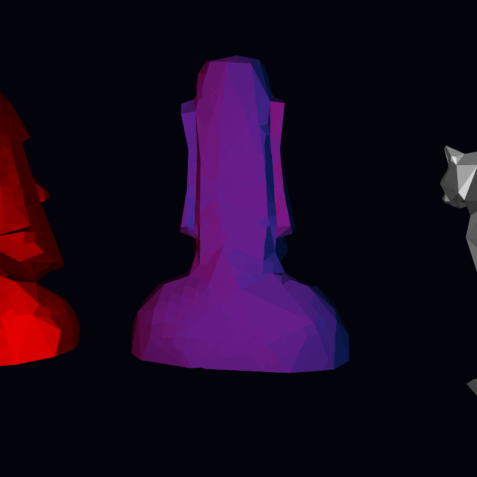

<!-- README.md is generated from README.Rmd. Please edit that file -->

# scenesetr

<!-- badges: start -->
<!-- badges: end -->

The goal of scenesetr is to allow R users to interactively explore and
animate custom 3-D scenes. scenesetr provides intuitive tools to define
behaviours of lights, cameras and objects in response to key inputs and
each other, and to record scenes as they pan out in real time. Recorded
scenes can be replayed to a separate device such as `png()`.

Scene objects can be read from .obj files or `stars` raster objects.

For the moment, key input is only available on Windows.

## Installation

You can install the development version of scenesetr from
[GitHub](https://github.com/) with:

``` r
# install.packages("devtools")
devtools::install_github("hrryt/scenesetr")
```

<figure>

<figcaption aria-hidden="true">Three rotating 3-D objects. From left to
right: moai, moai, cat.</figcaption>
</figure>
