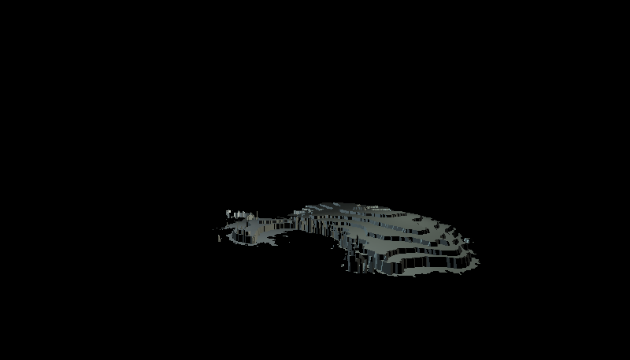

<!-- README.md is generated from README.Rmd. Please edit that file -->

# scenesetr

<!-- badges: start -->

[](https://github.com/hrryt/scenesetr/actions/workflows/R-CMD-check.yaml)
<!-- badges: end -->

The goal of scenesetr is to allow R users to interactively explore and
animate custom 3-D scenes. scenesetr provides intuitive tools to define
behaviours of lights, cameras and objects in response to key inputs and
each other, and to record scenes as they pan out in real time. Recorded
scenes can be replayed to a separate device or saved to GIF.

Scene objects can be read from .obj files or `stars` raster objects.

For the moment, key input is only available on Windows.

## Installation

You can install the development version of scenesetr from
[GitHub](https://github.com/) with:

``` r
# install.packages("devtools")
devtools::install_github("hrryt/scenesetr")
```

## Usage

``` r
# install.packages(c("magrittr", "gifski"))
library(magrittr)
library(scenesetr)
```

### Visualise raster objects

``` r
# install.packages(c("sf", "dplyr", "stars"))
# Shapefile from the British Antarctic Survey
# https://data.bas.ac.uk/items/0779002b-b95d-432f-b035-b952c36aa5c9/
antarctica <- sf::read_sf("add_contours_medium_res_v7.3") %>%
  dplyr::mutate(
    contour = contour / 1e3,
    geometry = geometry / 1e5,
    .keep = "none"
  ) %>%
  dplyr::arrange(contour) %>%
  sf::st_polygonize() %>%
  stars::st_rasterize() %>%
  st_as_obj() %>% # Convert raster to scene object
  place(c(0,0,0)) %>%
  paint(c("lightblue", "white")) %>%
  behave(spin("right", 6, quit_after_cycle = TRUE))

scene <- scene(
  antarctica,
  camera(aspect = 7/4) %>% place(c(0,10,-40)),
  light() %>% place(c(-20,10,0)), # Point lighting
  light() %>% place(c(20,10,0)) %>% paint("lightyellow")
)

record_gif(scene)
```

<figure>

<figcaption aria-hidden="true">Rotating 3-D render of Antarctica. Data
from BAS</figcaption>
</figure>

### Simulate emergent behaviour

``` r
boid <- obj_example("cat.obj") %>%
  read_obj() %>%
  behave(boid)

set.seed(1)
scene <- scene(
  camera() %>% place(c(0,0,-300)),
  light() %>% place(NA) %>% point(c(0,0,1)), # Directional lighting
  list = replicate(20, list(boid %>% place(200 * runif(3)))) # 20 boids
)

recording <- record(scene) # Record interactively
record_gif(recording)
```

<figure>

<figcaption aria-hidden="true">Cats behaving as a swarm of
boids</figcaption>
</figure>

### Design interactive experiences

``` r
moai <- obj_example("moai.obj") %>%
  read_obj() %>%
  paint(c("red", "purple"))

cat <- read_obj(obj_example("cat.obj"))

scene <- scene(
  moai %>%
    place(c(0,0,15)) %>%
    point(c(0,1,0)) %>%
    rotate("clockwise", 30) %>%
    behave(spin("down", 3), pushable, fragile),
  cat %>%
    place(c(15,0,15)) %>%
    point(c(0,0,-1)) %>%
    paint("orange") %>%
    behave(fragile),
  moai %>%
    behave(bullet),
  cat %>%
    place(c(0,0,0)) %>%
    paint("white") %>%
    behave(wasd, jump),
  light() %>%
    paint("yellow") %>%
    place(c(0,0,-10)),
  light() %>%
    behave(float_behind), # Spotlight
  light(),
  camera() %>%
    behave(float_behind)
)

recording <- record(scene) # Record interactively
record(recording) # Replay recording
record_gif(recording) # Save to GIF
```

<figure>

<figcaption aria-hidden="true">Interactive control of objects, lights
and cameras</figcaption>
</figure>
