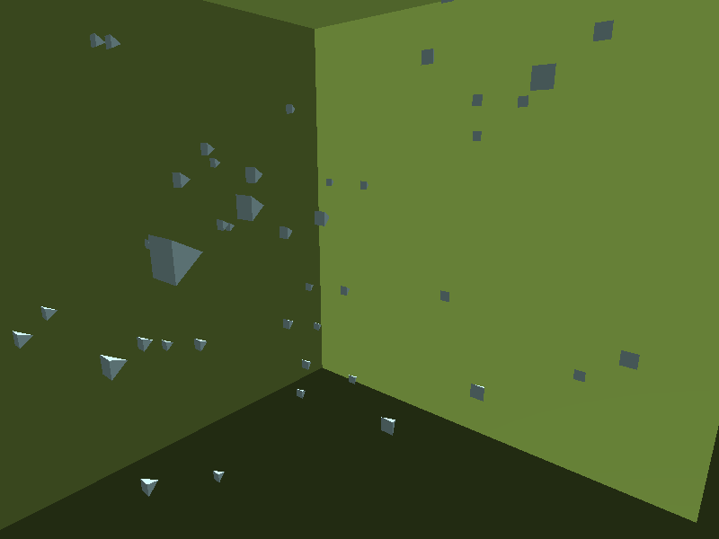

<!-- README.md is generated from README.Rmd. Please edit that file -->

# scenesetr

<!-- badges: start -->
<!-- badges: end -->

The goal of scenesetr is to allow R users to interactively explore and
animate custom 3-D scenes. scenesetr provides intuitive tools to define
behaviours of lights, cameras and objects in response to key inputs and
each other, and to record scenes as they pan out in real time. Recorded
scenes can be replayed to a separate device or saved to GIF.

Scene objects can be read from .obj files and `stars` raster objects.

For the moment, key input is only available on Windows.

## Installation

You can install the development version of scenesetr from
[GitHub](https://github.com/) with:

``` r
# install.packages("devtools")
devtools::install_github("hrryt/scenesetr")
```

## Usage

``` r
# install.packages(c("magrittr", "gifski"))
library(magrittr)
library(scenesetr)
```

### Visualise raster objects

``` r
# install.packages(c("sf", "stars"))
mosaic <- . %>%
  list.files(full.names = TRUE) %>%
  lapply(stars::read_stars) %>%
  do.call(what = stars::st_mosaic) %>%
  stars::st_downsample(10) %>%
  multiply_by(1.5e-4)

# read .tif files to stars raster
# NOAA National Centers for Environmental Information. 2022: ETOPO 2022 15 Arc-Second Global Relief Model. 
# NOAA National Centers for Environmental Information. DOI: 10.25921/fd45-gt74. Accessed 01/03/2024.
ice_mosaic <- mosaic("greenland_ice")
bed_mosaic <- mosaic("greenland_bed")

# Constant sea level
sea_mosaic <- bed_mosaic
sea_mosaic[[1]][!is.na(sea_mosaic[[1]])] <- 0 
# Remove bed below sea level
bed_mosaic[[1]][bed_mosaic[[1]] < 0] <- NA 
ice_mosaic[[1]][ice_mosaic[[1]] < 0] <- NA
# Remove ice below bed
ice_mosaic[[1]][(ice_mosaic - bed_mosaic)[[1]] <= 0] <- NA

# Convert raster to scene object
globe <- . %>%
  st_as_obj(as_sphere = TRUE) %>%
  place(c(0,0,12)) %>%
  rotate("up", 75) %>%
  rotate("right", 25)

sea <- globe(sea_mosaic) %>% paint("royalblue4")
bed <- globe(bed_mosaic) %>% paint("darkolivegreen")
ice <- globe(ice_mosaic) %>% paint("#ffffff99")

# Create a scene with objects, lights and a camera
scene <- scene(
  sea, bed, ice,
  light(),
  light() %>% place(NA) %>% point(c(-1,0,0)) %>% paint("lightyellow"),
  camera(aspect = 7/4) %>% rotate("right", 30) %>% behave(quit_after_frame)
)

# Record to png
record(scene, render_order = 1:3, device = png, width = 800)
```

<figure>

<figcaption aria-hidden="true">Ice cover of Greenland over bed
topography</figcaption>
</figure>

### Simulate emergent behaviour

``` r
boid <- obj_example("cat.obj") %>%
  read_obj() %>%
  behave(boid)

# Randomly position 20 boids
set.seed(1)
scene <- scene(
  camera() %>% place(c(0,0,-300)),
  light() %>% place(NA) %>% point(c(0,0,1)),
  list = replicate(20, list(boid %>% place(200 * runif(3))))
)

# Record interactively and replay to gif
recording <- record(scene)
record_gif(recording)
```

<figure>

<figcaption aria-hidden="true">Cats behaving as a swarm of
boids</figcaption>
</figure>

### Design interactive experiences

``` r
moai <- obj_example("moai.obj") %>%
  read_obj() %>%
  paint(c("red", "purple"))

cat <- read_obj(obj_example("cat.obj"))

scene <- scene(
  moai %>%
    place(c(0,0,15)) %>%
    point(c(0,1,0)) %>%
    rotate("clockwise", 30) %>%
    behave(spin("down", 3), pushable, fragile),
  cat %>%
    place(c(15,0,15)) %>%
    point(c(0,0,-1)) %>%
    paint("orange") %>%
    behave(fragile),
  moai %>%
    behave(bullet),
  cat %>%
    place(c(0,0,0)) %>%
    paint("white") %>%
    behave(wasd, jump),
  light() %>%
    paint("yellow") %>%
    place(c(0,0,-10)),
  light() %>%
    behave(float_behind),
  light(),
  camera() %>%
    behave(float_behind)
)

recording <- record(scene)
record_gif(recording)
```

<figure>

<figcaption aria-hidden="true">Interactive control of objects, lights
and cameras</figcaption>
</figure>
